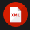

# Documentación UD1 Lenguajes de Marcas

## Introducción a los lenguajes de marcas

### Definición

Un lenguaje de marcas organiza información mediante una sintaxis basada en marcas o etiquetas .

### Clasificación de Lenguajes de marcas

|Tipo|Uso|Ejemplos|
|----|---|--------|
|Presentación|Dar formato a documentos de texto|HTML, CSS|
|Intercambio de información|Almacenar información de forma ordenada|XML, RSS|
|Documentación|Documentar proyectps|Markdown, WikiTex|

## Instalación y configuración del entorno

1. Instalamos [VS Code](https://code.visualstudio.com/)
2. Instalamos plugins
   - [Markdown all in one](https://marketplace.visualstudio.com/items?itemName=yzhang.markdown-all-in-one)
   - [HTML CCS Support](https://marketplace.visualstudio.com/items?itemName=ecmel.vscode-html-css)
   - [Live Preview](https://marketplace.visualstudio.com/items?itemName=ms-vscode.live-server)
   - [XML](https://marketplace.visualstudio.com/items?itemName=redhat.vscode-xml)
3. Instalamos git
   ```bash
   sudo apt install git
   ```
4. Configurar repositorio git (en la carpeta principal del proyecto)
   ```bash
   git init
   git add .
   git commit -m "Inicializar repositorio y README básico UD1"
   ```
5. Conectar con github
   ```bash
   git remote add origin url-repo
   git branch -M main
   git push -u origin main
   ```

## Descripción de plugins

|Nombre|Imagen|Uso|
|------|------|---|
|Markdown all in one||Permite escribir en Markdown|
|HTML CSS Support||Añade cierto auto-completado de código a las páginas, a través del estilo CSS que tengamos enlazado|
|Live Preview||Permite visualizar en tiempo real los cambios realizados en archivos HTML, CSS y JavaScript directamente en el navegador|
|XML||Dota a VS Code de las herramientas necesarias para reconocer adecuadamente el XML|